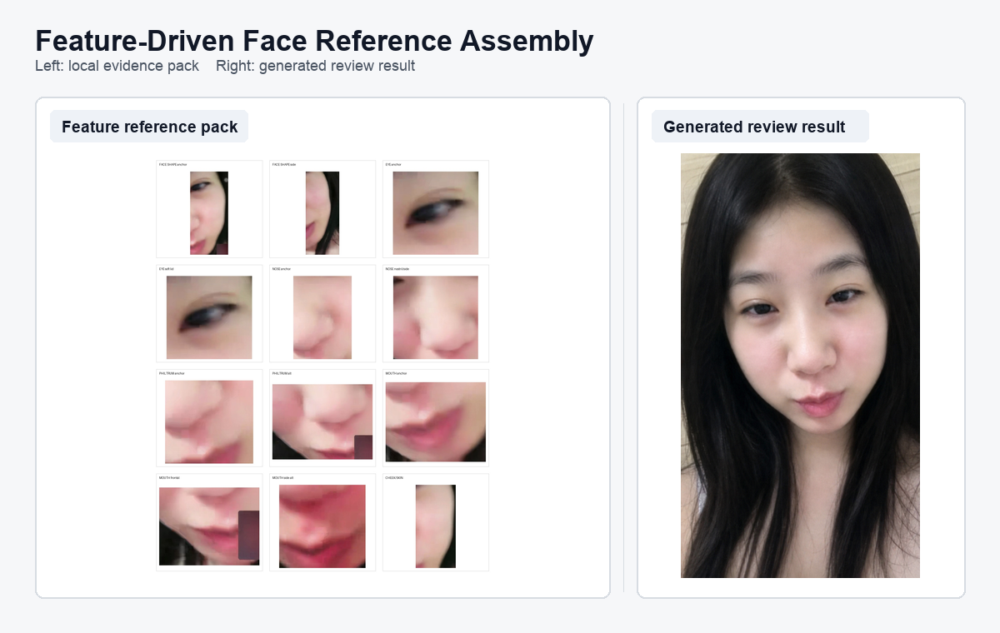

# Video Face Reference Builder

An implementation for building traceable face-reference assets from a difficult, close-range, partial-face video.

The project keeps original video frames as the evidence base. AI-generated images are review artifacts, not ground truth.

## What This Repo Does

The input case is a video where the face is close to the camera, partially visible, blurred in places, and never available as one clean full-face frame.

The repository implements a reference-building approach:

- search the whole video before selecting useful moments
- score and review candidate frames
- keep original selected frames as the primary evidence
- optionally compare CodeFormer/GFPGAN enhancement outputs
- crop local face components such as mouth, nose, philtrum, eye, cheek, and face shape
- build a compact strong feature pack from those components
- generate a constrained full-face review result with AI
- compare the result against the feature pack in a review sheet

## Implemented Pipeline

```text
video
-> global frame sampling
-> deterministic frame scoring
-> contact sheets
-> AI-assisted keyframe review
-> dense sampling around useful windows
-> selected original keyframes
-> optional CodeFormer/GFPGAN reference comparison
-> AI-curated local face crops
-> strong feature reference pack
-> imagegen full-face review result
-> feature pack vs result review sheet
```

The final generated face is not assembled with OpenCV stitching. OpenCV is used for video/frame IO and deterministic scoring, while `imagegen` is used for the full-face review result.

## Technology Boundaries

OpenCV is used for:

- reading video metadata and frames
- writing extracted frames
- grayscale conversion
- Laplacian variance sharpness scoring

CodeFormer/GFPGAN is optional:

- it runs only after original keyframes are selected
- enhanced images are auxiliary references
- enhanced images never replace original selected keyframes

AI is used for:

- visual review of frame usefulness
- local face-region crop curation
- constrained full-face review result generation

The generated result is useful for review and iteration, but uncertain regions remain AI-inferred.

## Example Result



Case assets:

- [Overview](docs/cases/feature_driven_ai_assembly_20260611/assets/feature_result_overview.png)
- [Selected keyframes](docs/cases/feature_driven_ai_assembly_20260611/assets/selected_keyframes.jpg)
- [Primary original scaffold](docs/cases/feature_driven_ai_assembly_20260611/assets/primary_scaffold_selected_003.jpg)
- [Strong feature pack](docs/cases/feature_driven_ai_assembly_20260611/assets/strong_feature_reference_pack.jpg)
- [Generated result](docs/cases/feature_driven_ai_assembly_20260611/assets/result_feature_driven.png)
- [Review sheet](docs/cases/feature_driven_ai_assembly_20260611/assets/feature_pack_vs_result_review_clear.png)

## Documentation

- [Implementation approach](docs/implementation_approach.md)
- [Generated result prompt record](docs/result_feature_driven_flow.md)
- [Case notes](docs/cases/feature_driven_ai_assembly_20260611/README.md)
- [Project skill](skills/video-face-reference-builder/SKILL.md)

The full project skill is:

```text
skills/video-face-reference-builder/SKILL.md
```

Its generated-result reference prompt is:

```text
skills/video-face-reference-builder/references/feature_driven_assembly.md
```

## Repository Layout

```text
src/vfrb/                         core Python package
scripts/                          case and pipeline scripts
docs/implementation_approach.md    detailed implementation notes
docs/result_feature_driven_flow.md prompt and result-generation record
docs/cases/.../assets/             lightweight GitHub case assets
skills/video-face-reference-builder/ project Codex skill
tests/                            pytest coverage
```

## Run

```bash
.venv/bin/python -m pytest -q
.venv/bin/python scripts/run_case.py
.venv/bin/python scripts/run_keyframe_selection.py
.venv/bin/python scripts/build_strong_feature_reference_pack_case.py
```

Local videos, generated outputs, model weights, and `.venv/` are not committed.

## Current Status

Implemented:

- video metadata reading
- frame extraction
- deterministic frame scoring
- contact sheet generation
- keyframe selection case output
- optional enhancement summary handling
- local reference crop boards
- strong feature pack construction
- GitHub case assets and overview image
- project Codex skill for reproducing the method

Not claimed:

- verified identity reconstruction
- fully automated final identity matching
- OpenCV-based full-face stitching
- guaranteed recovery when the source video lacks enough evidence
